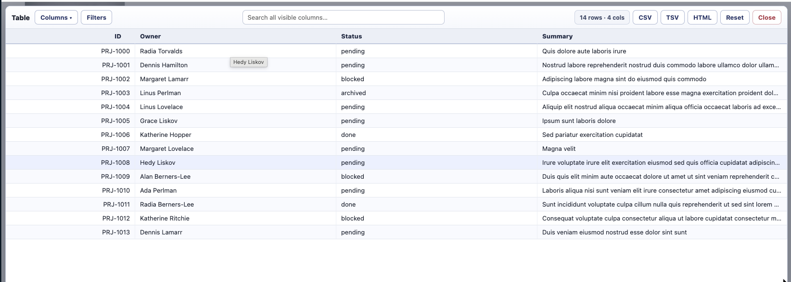
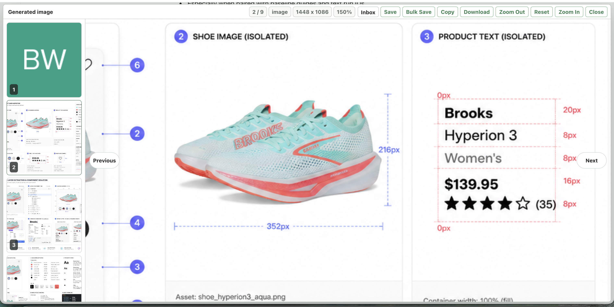
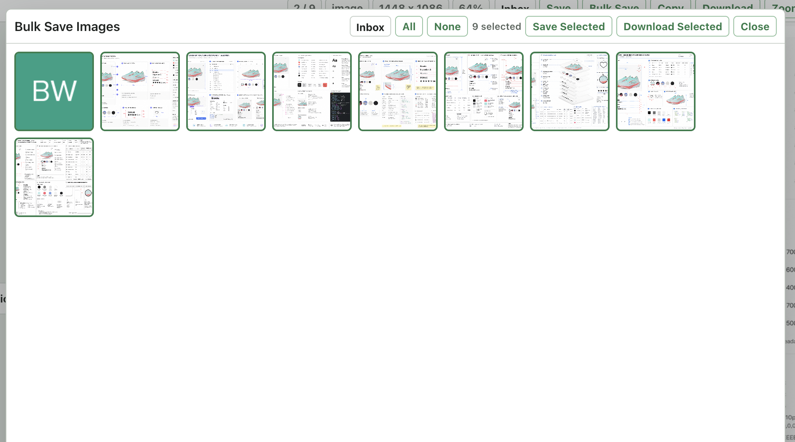
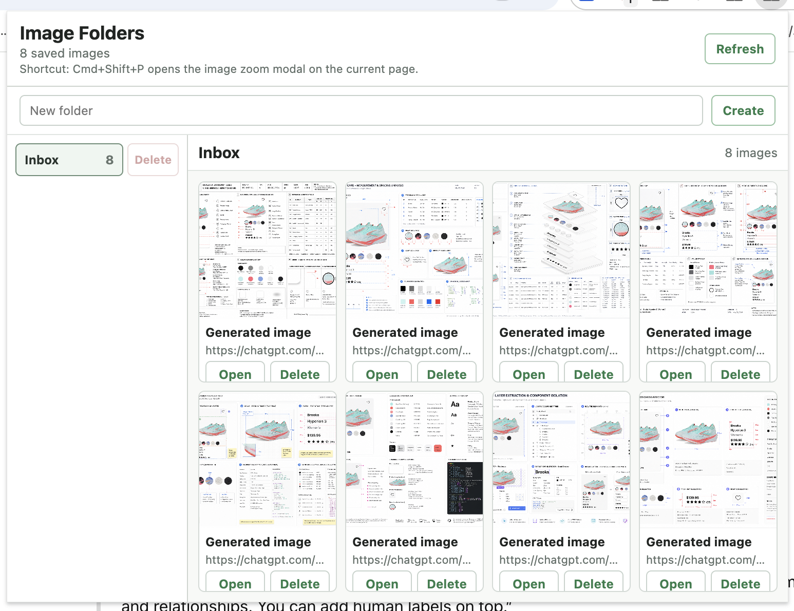

# Alt Zoom — Image & Table Viewer

Unpacked Chrome extension that turns **Alt-click** into a universal inspector:

- **Alt-click an image** → a full-screen, zoomable image modal with carousel navigation, saving, and bulk download.
- **Alt-click a table or CSS grid** → a full-screen, sortable/filterable table viewer with column controls and CSV/TSV/HTML copy.

The two overlays are completely independent code paths — they never mix — and a set of heuristics decides which one a given Alt-click should open.

## Screenshots

### Table Viewer

### Page Image Zoom Modal

### Bulk Save Grid

### Folder Viewer

---

## Image Processing

Alt-click any image (or `<video>`) to open the zoom modal.

### Viewing

- Press `Cmd+Shift+P` anywhere on a page to open the modal for the best visible image.
- Every page image and video is collected into a thumbnail carousel; the clicked item becomes the active one.
- Fit-to-stage viewing, wheel zoom, button zoom, double-click reset, and drag panning.
- Previous/next navigation with buttons, thumbnails, and keyboard arrows.
- A **Grid** view shows all collected media at once for quick selection.
- **Jump** closes the modal and scrolls back to the active image on the page, flashing it briefly.
- Videos play inline with native controls; their poster/dimensions are used for thumbnails and fit.

### Saving & exporting

- **Copy** the active image to the clipboard, or **Download** it.
- **Bulk Save**: pick multiple page images from a thumbnail grid, then save or download them.
- Save images into extension-owned **folders** backed by IndexedDB.
- Saved images are de-duplicated within a folder by **SHA-256 content hash**.
- Open a saved folder in a full-tab **folder viewer**.
- **Download All** in the folder viewer downloads a single image directly, or zips multiple images.
- Right-click an image and choose **Save image to Inbox** for a fast default save (context menu).

---

## Table Processing

Alt-click any `<table>`, ARIA grid (`role="table"` / `role="grid"` / `role="treegrid"`), or CSS `display:grid`
container to open the table viewer. This overlay is kept fully separate from the image modal.

### Extraction → one common data model

All three source types are normalized into a single `{ columns, rows }` structure and then re-rendered as
a clean HTML table. This shared model is what makes sorting, filtering, reordering, and copy work uniformly
regardless of the original markup.

- **Real `<table>`** — walked into a rectangular matrix with full `colspan` / `rowspan` expansion. Header
  rows are detected from `<thead>` or a leading all-`<th>` row.
- **CSS grids** (`display:grid`) and **ARIA grids** — children are grouped into rows by their on-screen
  position (top/left geometry), so wrapped and span-based layouts still come out as a clean matrix. ARIA
  grids prefer explicit `role="row"` / `role="columnheader"` / `role="cell"` structure when present.
- **Column types** (text vs. number) are auto-detected by sampling each column; numeric parsing tolerates
  `$`, `,`, `%`, and `(parenthesized)` negatives, so numbers sort numerically rather than lexically.

### Is this grid actually a table?

Because `display:grid` is used for page *layout* (image galleries, card lists, app chrome) as often as for
data, grids are run through a heuristic before opening. A grid is treated as **not** tabular when it has
fewer than two rows/columns, is dominated by media cells (images/videos/canvases), or has almost no text. In
that case the viewer does **not** open — instead a small dismissible toast appears in the bottom-right corner:

> **Not a table?** This grid looks like an image gallery. Click to open it anyway.

Clicking the toast force-opens the viewer for that element (and bypasses the heuristic). Real `<table>` and
ARIA grids always open directly. An Alt-click on an actual image always defers to the image modal, even when
that image lives inside a table cell.

### Interacting with the table

- **Sort** — click a column header to cycle asc → desc → off. Numeric columns sort numerically.
- **Filter** — a global search box matches across all visible columns; toggle **Filters** for an optional
  per-column filter row (each column gets its own "contains" box).
- **Show / hide columns** — the **Columns** panel lists every column with a checkbox, plus *Show all* /
  *Hide all*. It closes on outside click, on the trigger, or with `Escape`.
- **Use first row as header** — toggle in the Columns panel for grids/tables that lack an explicit header.
- **Reorder columns** — drag a column header left/right (drop indicators show where it lands).
- **Resize columns** — drag a header's right edge; double-click the edge to auto-fit.
- **Reset** — clears sort, filters, search, and restores the original columns.
- Sticky header, zebra striping, a live row/column count, and a render cap (the on-screen table caps at 5,000
  rows for responsiveness; copy still exports every matching row).

### Copy reflects exactly what's on screen

The **CSV**, **TSV**, and **HTML** buttons export the *current view* — visible columns in their current
order, with the active filters and sort applied — not the raw source. CSV is RFC-quoted; HTML is written to
the clipboard as both rich `text/html` and a plain-text fallback.

---

## Shortcuts

- `Alt` + click image/video → open it in the image zoom modal.
- `Alt` + click table / ARIA grid / CSS grid → open it in the table viewer.
- `Cmd+Shift+P` → open the image zoom modal for the best visible image.

While the **image modal** is open:

- `ArrowLeft` / `ArrowRight` → previous / next image.
- `+` or `=` → zoom in. `-` → zoom out. `0` → reset zoom.
- `g` → toggle the image grid. `j` → close and jump to the active image.
- `Escape` → close the grid (if open) or the modal.

While the **table viewer** is open:

- `Escape` → close the Columns panel (if open) or the viewer.

Both viewers fully consume the keys they handle (capture phase), so `Escape` and the other shortcuts do not
leak back into the underlying page/app.

---

## Popup & Test Page

- Click the extension toolbar icon to open the **folder browser** (create/delete folders, view and manage
  saved images).
- Click **Test page** in the popup header to open an autogenerated page for exercising both viewers. It
  includes a mix of inline-SVG and remote placeholder (picsum.photos) images plus four tables: varying-length
  text, a CSS `display:grid` table, a numeric table for sorting, and a **3,000-row** table to stress scroll
  and copy. The test page is one of the extension's own pages and loads the viewer scripts directly.

---

## Install As Unpacked Extension

1. Open `chrome://extensions`.
2. Enable **Developer mode**.
3. Click **Load unpacked**.
4. Select this repository folder.

After editing extension files, click **Reload** for the extension in `chrome://extensions`, then refresh any
webpage where the content scripts should run.

## Implementation Notes

- No build step and no external dependencies — plain JavaScript, HTML, and CSS.
- Content scripts: `src/table.js` (table viewer) loads before `src/content.js` (image modal) so the table
  detector gets first claim on Alt-clicks; each defers to the other for the cases it shouldn't handle.
- `chrome.storage` holds extension preferences; **IndexedDB** stores saved image bytes and folder data, which
  remain available after you leave the original page.
- Some sites restrict image fetching. Viewing can still work even when copy/save/download fail, since those
  actions require fetching the image bytes.
